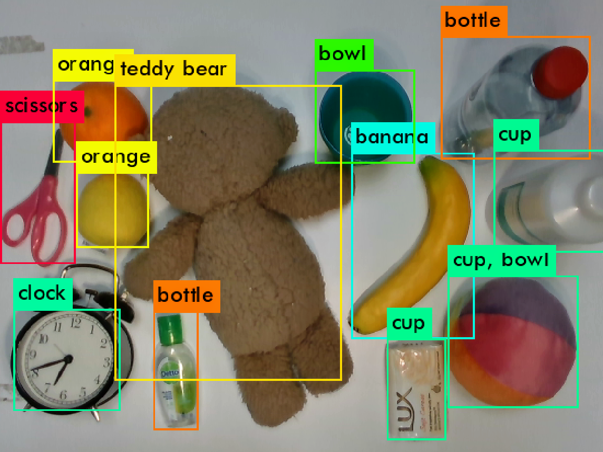
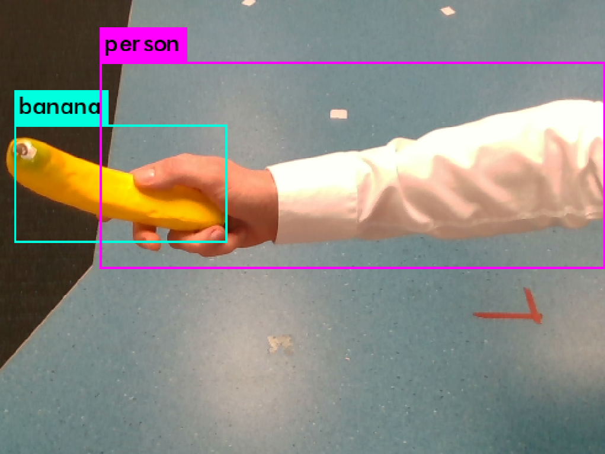

# Driver for YOLOv3-powered human-to-robot handovers #

**ATTENTION: This repository is outdated and will not be continued.**

Problem definition for the student project "YOLOv3 Handovers". The task highlighted with "TODO" needs to be solved/added.

## License

The project is licensed under the 4-clause BSD License.
